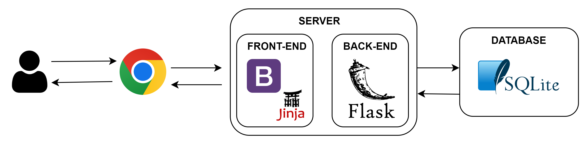
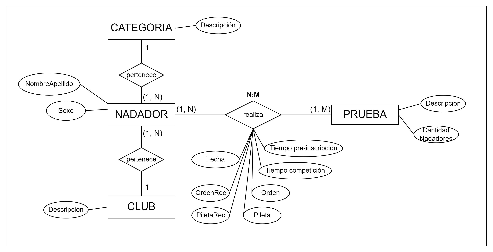
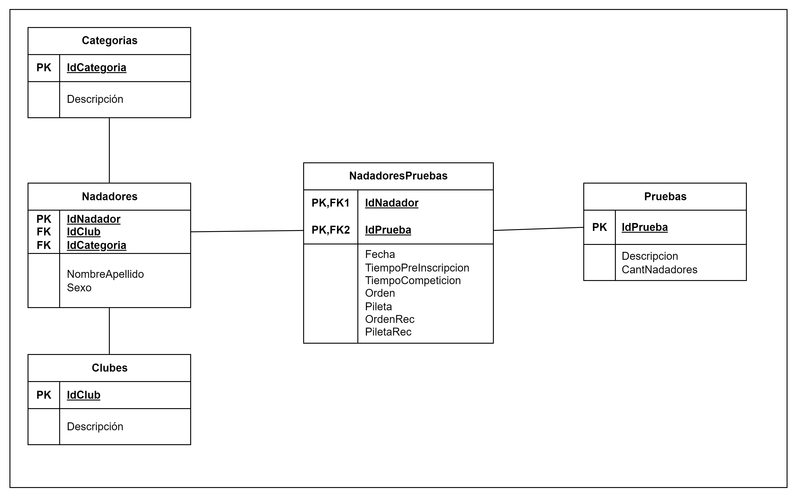

# Natación APP

## Descripción del sistema
Natación APP permite a los organizadores de torneos de natación registrar competidores en cada uno de los eventos existentes, ordenarlos de forma automática, registrar sus tiempos de competición y generar rankings por evento para determinar ganadores.

El eje de la aplicación se encuentra en el  ordenamiento automático de los nadadores en los eventos. Cada evento está conformado por una prueba, una categoría de edad y una categoría de género (que puede ser Varones, Mujeres o Mixto). De esta forma, se puede tener un evento que sea '100m libres - Categoría A - Mujeres' y otro distinto que sea '100m libres - Categoría A - Mixto'. 

A su vez, en cada uno de estos eventos se encontrarán registrados una cantidad $n$ de nadadores, que deben competir en una pileta de 6 carrilles o andariveles. Los competidores con un tiempo de pre-inscripción menor (tiempo obtenido en entrenamientos) deben ubicarse en los carrilles centrales. Si existen más de 6 nadadores registrados, se deben dividir en distintas piletas de forma equitativa.  

Además se incluye un ordenamiento recreativo que permite ordenar a los nadadores de un evento de forma aleatoria, sin tener en cuenta su tiempo de pre-inscripción. En este modo no existe la carga de resultados, ya que no forman parte de los eventos competitivos. 

## Funcionalidades

- Alta, baja, modificación y consulta de Nadadores
- Alta, baja, modificación y consulta de Pruebas
- Alta, baja, modificación y consulta de Clubes
- Alta, baja, modificación y consulta de Categorías
- Ordenamiento de nadadores por pileta en formato competitivo
- Ordenamiento de nadadores por pileta en formato recreativo
- Carga y modificación de tiempos obtenidos por cada nadador en la competencia
- Ranking de ganadores en cada evento según su tiempo de competición
- "Cancheo": creación de reportes en formato PDF por club, listando todas las pruebas de sus nadadores, e indicando serie y andarivel en el cual compiten.

## Stack Tecnológico

### Capa de Datos
En la capa de datos, se optó por utilizar SQLite, una herramienta de código abierto que facilita el almacenamiento de información en diversos dispositivos de manera sencilla, eficiente, potente y rápida. La elección de esta tecnología se basa en la simplicidad de los datos que necesitan ser registrados y en la velocidad requerida para escribir dicha información. Además, dado que la aplicación no maneja datos sensibles, no se necesita un nivel de seguridad más elevado que el proporcionado por este motor de base de datos.

### Capa de Negocio
La capa de negocio está definida utilizando el framework de código abierto Flask. Flask es conocido como un "microframework", lo que significa que proporciona las funcionalidades esenciales para el desarrollo web sin imponer una estructura o conjunto de herramientas rígidas. 

### Capa de Presentación
Por último, en la capa de presentación se emplea una combinación de dos tecnologías: Bootstrap y Jinja2. Estas son tecnologías complementarias, que se utilizan en el desarrollo web para crear aplicaciones web atractivas y dinámicas. Bootstrap se encarga del diseño y la apariencia, mientras que Jinja2 se utiliza para generar contenido HTML de manera dinámica y basada en datos del servidor.

## Diagrama Entidad-Relación

## Modelo de datos

